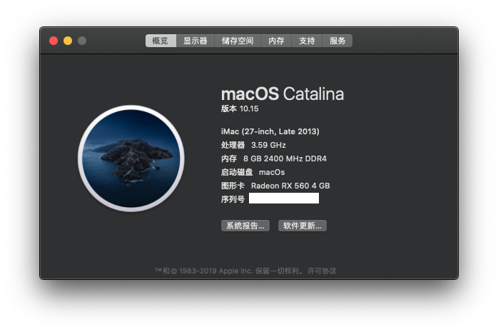
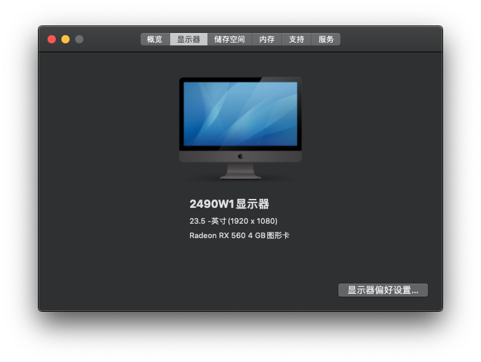

技嘉GA-AB350M-Gaming3黑苹果EFI
# 技嘉GA-AB350M-Gaming3黑苹果EFI

# 适配10.15

## 电脑配置

| 规格     | 详细信息                                             |
| -------- | ---------------------------------------------------- |
| 主板型号 | 技嘉GA-AB350M-Gaming 3                               |
| 操作系统 | macOS Mojave 10.15                         |
| 处理器   | AMD Ryzen 5 1600X 6 Cores - 3600 MHz - 95 watts      |
| 内存     | Kingston 4GB 2400MHz DDR4 + Gloway 4 GB 2400MHz DDR4 |
| 硬盘     | TOSHIBA TR200 240GB                                  |
| 显卡     | XFX讯景RX560D 4G                                     |
| 显示器   | AOC I2490VXH/BS 23.8英寸                             |

## 系统截图

## [安装教程](https://github.com/AMD-OSX/AMD_Vanilla)

